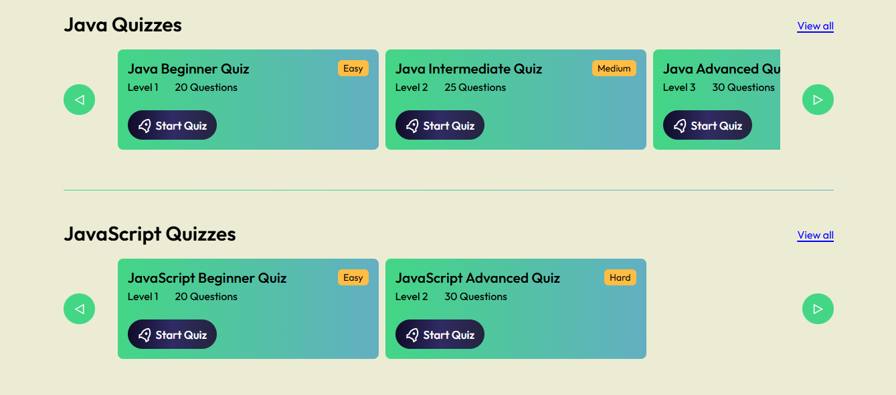

# Quiz Overflow - Ultimate Quiz Platform For Developers
## 🚀 Overview
**Quiz Overflow** is a full-stack flagship web application designed for developers to test and improve their programming skills through MCQ-based quizzes. With user authentication, role-based access (user/admin), badges for achievements, quiz progress tracking, and a clean UI, this platform is built with learning, engagement, and performance in mind.

> This project took over a month of consistent effort to build from scratch. Every component, route, and feature was carefully crafted and tested to deliver a smooth, interactive, and secure experience. Whether you're preparing for technical interviews, practicing daily challenges, or just leveling up your dev skills, **Quiz Overflow** is your go-to companion.

 

## 🚀 Screenshots

  

 

## 🚀 Features
### 🎯 User Functionality
- Register and login securely
- View available quizzes by category, topic, and level
- Attempt quizzes and get real-time scoring
- Earn badges for high performance
- Track quiz history and progress in your profile
- Share achievements with public profile links
### 🎯 Admin Dashboard
- Add, update, or delete quizzes
- View user details and quiz activity
- Monitor badge achievements by quiz
- Secure access restricted to admin role only
### 🎯 Quiz System
- Dynamic quiz rendering from the database
- Category and difficulty level filtering
- Scoring system and badge logic (badge earned based on score threshold)

 

## 🚀 Tech Stack
### 🎯 Frontend
- **React.js** – Frontend framework
- **React Router DOM** – Routing and navigation
- **Context API** – Global state management
- **React Hook Form** – Form validation
- **Vanilla CSS** – Custom styling
### 🎯 Backend
- **Node.js** – Server-side JavaScript
- **Express.js** – Web server and routing
- **MongoDB + Mongoose** – NoSQL database and ODM
- **JWT + Cookies** – Secure user authentication
- **bcryptjs** – Password hashing
- **Nodemailer** – Email integration
### 🎯 Dev Tools & Deployment
- **Postman** – API testing
- **Vercel** – Full-stack deployment
- **MongoDB Atlas** – Cloud-hosted database

 

## 🚀 Deployment
The app is deployed on <b>Vercel</b> and can be accessed via:
 
https://quiz-overflow.vercel.app/

 

## 🚀 Contact
- LinkedIn: www.linkedin.com/in/ibadhussain